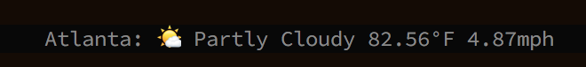

# tmux f0rkz weather (fweather)

Get the weather in your tmux status bar!



# API Key
An API key from [DarkSky.net / Forcast.io](https://darksky.net/) is required.

The API key needs to either be exported as `FORECASTIO_KEY` or loaded as a json file in:

`~/.config/forecastio.json`

Which will look like this:
```json
{
      "token": "YOURTOKENHERE",
      "frequency": 90
}
```

Or simply plop the variable in your .bashrc .tmuxrc, etc.

```bash
export FORECASTIO_KEY="YOURKEYHERE"
export FORECASTIO_CALL_FREQUENCY="90"
```

The script will load one or the other (it will load the JSON first, then the ENV).

# Install

This python script requires the `requests` library which may already be installed on most systems.
Just to be sure, install it with `pip`:

`pip install -r requiremets.txt`

Copy `fweather` into your tmux bin files directory. I keep mine in `~/bin/`

`cp fweather ~/bin/`

Enable fweather in tmux:

`set -g status-right "#(~/bin/fweather)"`

Reload tmux

`C-r`
